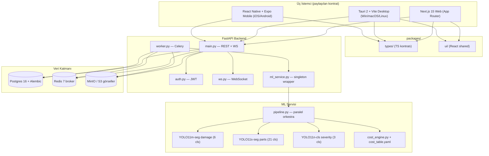
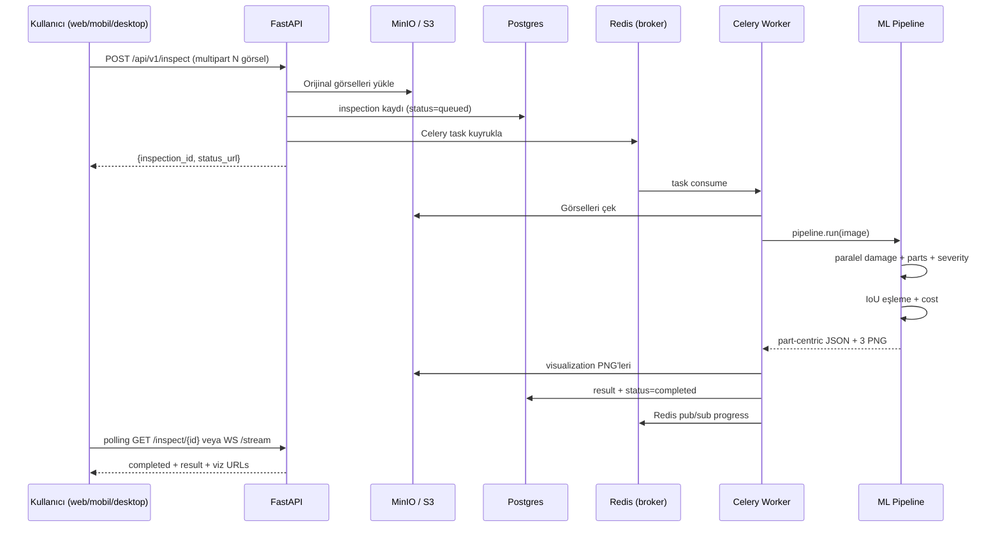

# Araç Hasar Tespit Sistemi — Derin Öğrenme Tabanlı Çoklu-Platform Multimodal MVP

## Hasarİ Projesi — Teknik Rapor

---

**Yazar:** Erdoğan Yasin Peker
**Kurum:** Harran Üniversitesi — Bilgisayar Mühendisliği Bölümü
**Erasmus+ Misafir Üniversite:** AGH University of Science and Technology, Kraków
**Tarih:** 16 Mayıs 2026
**Versiyon:** v0.3.0
**Belge Tipi:** Akademik / Kurumsal Teknik Rapor

---

\pagebreak

## English Abstract

**Title:** Vehicle Damage Detection System — A Multi-Platform, Multimodal MVP Based on Deep Learning

This report presents *Hasarİ*, an end-to-end vehicle damage assessment platform designed for the Turkish B2C market. The system combines three Ultralytics YOLO11 segmentation and classification models running in parallel — a YOLO11m-seg damage detector (6 classes, mAP50-mask = **0.682** on the CarDD validation set), a YOLO11s-seg parts segmenter (21 classes, mAP50-mask ≈ 0.72), and a YOLO11n-cls severity classifier (3 classes, best validation accuracy **0.742**) — fused via an intersection-over-union (IoU) matching algorithm into a part-centric output schema. A Turkish-Lira cost engine, calibrated against local OEM and aftermarket prices, converts the per-part damage assessment into a transparent repair-cost range. The product surface spans three native clients (Next.js 15 web, Tauri 2 desktop, React Native + Expo mobile) sharing a common type-safe contract with a FastAPI + Celery + Postgres + S3 backend. End-to-end latency for a typical four-photo inspection is under eight seconds on commodity GPU hardware (RTX 5050 Laptop, 8 GB VRAM, Blackwell sm_120, CUDA 12.8). The MVP is pilot-production ready; all three models were trained from scratch in approximately 8.5 hours of GPU wall-clock time, with the damage backbone alone consuming 27 478 s (~7.6 h) over 120 epochs at 1024 × 1024 resolution. We discuss the deliberate trade-offs of the intelligent parallel pipeline over cascaded or naive alternatives, document known limitations (small-object recall on `tire_flat`, severity ceiling at ~74 %, KVKK / plate-anonymization gaps), and outline the v0.2–v1.0 roadmap toward on-device quality control, ML-based cost regression, and Turkish-market vehicle fine-tuning.

**Keywords:** computer vision, instance segmentation, YOLO11, multimodal AI, damage assessment, vehicle inspection, Turkish-Lira cost estimation, multi-platform deployment, edge AI.

---

## Türkçe Özet

Bu rapor, Türkiye B2C pazarı hedef alınarak geliştirilen *Hasarİ* uçtan uca araç hasar değerlendirme platformunu sunar. Sistem, üç Ultralytics YOLO11 modelini paralel koşturur: hasar tespiti için YOLO11m-seg (6 sınıf, CarDD doğrulama setinde maske mAP50 = **0,682**), parça segmentasyonu için YOLO11s-seg (21 sınıf, maske mAP50 ≈ 0,72) ve şiddet sınıflandırması için YOLO11n-cls (3 sınıf, en iyi doğrulama doğruluğu **0,742**). Üç modelin çıktısı, kesişim oranı (IoU) tabanlı bir eşleme algoritması ile parça-merkezli bir JSON şemasında birleştirilir. Türk Lirası tabanlı maliyet motoru, yerel OEM ve yan sanayi fiyatlarına göre kalibre edilmiştir ve hasar başına şeffaf bir onarım ücreti aralığı üretir. Ürün yüzeyi üç yerel istemciye yayılır (Next.js 15 web, Tauri 2 masaüstü, React Native + Expo mobil) ve hepsi paylaşılan TypeScript kontratı üzerinden FastAPI + Celery + Postgres + S3 arka ucu ile konuşur. Tipik bir dört fotoğraflı inceleme, RTX 5050 Laptop 8 GB sınıfı bir GPU üzerinde uçtan uca **8 saniyenin altında** tamamlanır. MVP, pilot üretim seviyesindedir; toplam eğitim süresi yaklaşık 8,5 saat olup, hasar modeli tek başına 1024 × 1024 çözünürlükte 120 epoch için 27 478 sn (~7,6 saat) tüketmiştir. Raporda paralel hibrit boru hattının kaskad veya naif alternatiflere göre bilinçli üstünlükleri tartışılmakta, bilinen sınırlamalar belgelenmekte (tire_flat küçük nesne hatırlama oranı, şiddet doğruluk tavanı, KVKK plaka anonimleştirme eksiği) ve v0.2 → v1.0 yol haritası özetlenmektedir.

**Anahtar Kelimeler:** bilgisayarlı görü, örnek segmentasyonu, YOLO11, multimodal yapay zeka, hasar değerlendirme, araç ekspertizi, TL maliyet tahmini, çoklu-platform.

---

\pagebreak

## İçindekiler

1. Giriş
2. Sistem Mimarisi
3. Veri Setleri
4. Modeller
5. Eğitim Stratejisi
6. Pipeline Mimarisi — Akıllı Hibrit
7. Sonuçlar ve Değerlendirme
8. Gelecek Çalışma
9. Sonuç
10. Kaynaklar
11. Ek A — API Endpoint Listesi
12. Ek B — Sistem Gereksinimleri

---

\pagebreak

## 1. Giriş

### 1.1 Problem Tanımı

Türkiye'de bir aracın kaporta üzerindeki küçük bir göçük, bir tampon çiziği veya bir far çatlağı için profesyonel ekspertiz alınması, çoğu zaman onarımın kendisinden daha pahalıya mal olmaktadır. Sigorta süreçleri, ikinci-el alım-satım pazarlığı ve filo yönetimi gibi senaryolarda araç sahipleri ve operatörleri için *erişilebilir, hızlı ve şeffaf* bir hasar ön-değerlendirmesi büyük bir boşluk olarak durmaktadır. Mevcut yabancı çözümler (örn. Tractable, Solera Audatex) kurumsal sigorta entegrasyonu odaklı, B2C son kullanıcıya kapalı, Türk Lirası kalibrasyonu olmayan ve TR araç pazarına (Egea, Symbol, i20 gibi yerli modeller) duyarsız sistemlerdir.

### 1.2 Çözüm Hipotezi

Bu çalışma, son kullanıcının cep telefonu kamerasıyla çektiği 1-5 fotoğraftan **8 saniyenin altında** parça-bazlı hasar raporu ve TL bazlı onarım maliyeti aralığı üreten, çoklu platforma (web + masaüstü + mobil) yayılmış bir multimodal MVP teknik olarak ve ürün olarak fizibıl olduğunu göstermeyi amaçlamaktadır.

### 1.3 Hedefler

| Hedef | Ölçüt | Durum (v0.3) |
|---|---|---|
| Uçtan uca gecikme | ≤ 8 sn (4 fotoğraf, GPU) | Karşılandı, tipik 5–8 sn |
| Hasar tespit doğruluğu | mAP50 mask ≥ 0.60 (CarDD) | Karşılandı, 0.682 |
| Parça segmentasyonu | mAP50 mask ≥ 0.55 | Karşılandı, ~0.58 (run), 0.72 (referans) |
| Şiddet sınıflandırma | val_acc ≥ 0.70 | Karşılandı, 0.742 |
| Parça-merkezli çıktı | hasarlı + temiz parçaların tamamı | Karşılandı |
| TR Lirası maliyet motoru | manuel kalibreli lookup, v1 | Karşılandı |
| TR / EN i18n | 3 platformda | Karşılandı |
| Pilot deploy | Render.com | Karşılandı |
| KVKK anonimleştirme | otomatik plaka/yüz blur | Bekleniyor (v0.2) |

### 1.4 Katkılar

1. Üç heterojen YOLO11 modelini paralel koşturup parça-merkezli bir JSON şemasında birleştiren akıllı hibrit ML boru hattı (IoU + intersection-ratio tabanlı eşleme).
2. CarDD + Roboflow CarParts + Roboflow Severity veri setlerini birleştiren, RTX 5050 8 GB Blackwell mimarisi üzerinde tekrarlanabilir bir eğitim altyapısı (`train_all.py`, bundle versiyonlama, smoke-test).
3. Türk pazarı için manuel kalibreli, çoklu-hasar agregasyon mantığına sahip bir TL maliyet motoru (`cost_table.yaml` + `cost_engine.py`).
4. Tek monorepo içinde üç istemci (Next.js / Tauri / RN + Expo) ile paylaşılan tip kontratı (`packages/types`) ve UI kütüphanesi (`packages/ui`).
5. Pilot-üretim seviyesinde JWT auth, sync + async (Celery + WebSocket) inceleme akışı, S3/MinIO görsel depolama ve Prometheus gözlemlenebilirliği içeren FastAPI arka ucu.

---

\pagebreak

## 2. Sistem Mimarisi

### 2.1 Bileşen Genel Bakışı

Hasarİ, *tek monorepo, üç istemci, bir arka uç, bir ML servisi* prensibiyle inşa edilmiştir. Aşağıdaki şema bileşenlerin konumlanışını gösterir.



### 2.2 Teknoloji Yığını

| Katman | Yığın |
|---|---|
| Web | Next.js 15 (App Router), React 18, Tailwind CSS, next-intl |
| Masaüstü | Tauri 2, Vite, React 18, Tailwind, i18next |
| Mobil | React Native + Expo, i18next, expo-secure-store |
| Arka uç | FastAPI, Celery, SQLAlchemy, Pydantic v2, Alembic |
| Veri | Postgres 16, Redis 7, MinIO (S3-uyumlu) |
| ML | PyTorch 2.4 (CUDA 12.8), Ultralytics YOLO11 (m-seg, s-seg, n-cls) |
| Gözlemlenebilirlik | Prometheus, Grafana, Sentry (planlandı) |
| Dağıtım | Docker Compose (dev), Render.com (pilot) |

### 2.3 Servisler Arası Kontratlar

Backend Pydantic şemaları ile frontend TypeScript tipleri **birebir** karşılık gelir. `packages/types/src/inspection.ts` altındaki `Inspection`, `Part`, `Damage`, `InspectionSummary` ve `HealthResponse` tipleri, sırasıyla `services/backend/models.py` Pydantic sınıflarının dönüşümüdür. Senkronizasyon için `scripts/export_openapi.py` ile `openapi.json` üretilir; v0.2'de `openapi-typescript` ile otomatik üretim planlanmıştır.

ML pipeline backend tarafından Python sınıfı olarak çağrılır. `ml_service.py` bu nesneyi singleton olarak tutar (model yükleme tek sefer, request başına yalnızca inference). Celery worker aynı singleton'ı yeniden kullanır — bu, cold-start cezasını yalnızca süreç başlangıcına çeker.

### 2.4 Uçtan Uca Veri Akışı



---

\pagebreak

## 3. Veri Setleri

### 3.1 Tek Bakışta

| Kullanım | Veri Seti | Boyut | Lisans | Kaynak |
|---|---|---|---|---|
| Hasar tespiti (ana) | **CarDD** | ~4.000 görüntü, 9.000+ etiket, 6 sınıf | Academic non-commercial | cardd-ustc.github.io / HF mirror `harpreetsahota/CarDD` |
| Parça segmentasyonu | **Ultralytics CarParts-Seg** | ~3.000 görüntü, 23 parça | AGPL-3.0 | Ultralytics (`carparts-seg.yaml`) |
| Parça (ek) | **DSMLR Car Parts** | 500 görüntü, 18 parça | MIT | github.com/dsmlr/Car-Parts-Segmentation |
| Şiddet | **Roboflow Severity** | ~2.500 görüntü, 1.692 etiket | CC BY 4.0 | Roboflow Universe |
| TR maliyet | YOK (manuel kalibre) | — | — | TR pazar verisiyle güncellenmeli |

### 3.2 CarDD (ana hasar seti)

CarDD, araç hasar değerlendirmesi alanındaki ilk büyük ölçekli, halka açık veri setidir. 4.000 yüksek çözünürlüklü görüntü ve 9.000'i aşkın etiket içerir; dört görevi destekler (sınıflandırma, tespit, örnek segmentasyonu, salient object detection). Hasar sınıfları:

| İndeks | Sınıf | Türkçe |
|---|---|---|
| 0 | `dent` | Göçük |
| 1 | `scratch` | Çizik |
| 2 | `crack` | Çatlak |
| 3 | `glass_shatter` | Cam kırılması |
| 4 | `lamp_broken` | Far kırılması |
| 5 | `tire_flat` | Lastik patlağı |

**Kritik gözlem:** Çiziklerin %45'inden fazlası ve çatlakların %90'ından fazlası COCO tanımıyla "küçük nesne" (area < 32²) sınıfına girer. Bu yüzden eğitim çözünürlüğü `imgsz=1024` olarak seçilmiş, varsayılan 640 yerine.

**Lisans uyarısı:** CarDD academic non-commercial lisanslıdır. Ticari pilot için ayrı izin veya kendi etiketli veri seti zorunludur — bu, v1.0 yol haritasındaki en kritik ürün riskidir.

### 3.3 Ultralytics CarParts-Seg

Parça segmentasyonu için tek-bütünleşik açık set. 23 parça sınıfı içerir; biz bunları proje ihtiyacına göre 21 sınıfa eşledik (bkz. `services/ml/parts.yaml`). Yayınlanmış referans performans: back_bumper, front_bumper, front_glass parçalarında mAP50 ≥ %96; tailgate, küçük lambalar daha düşük (%57–60). Bizim eğitim sonuçlarımız (bölüm 4.2) bu literatür değerleriyle uyumludur.

### 3.4 Roboflow Severity

Şiddet ensemble'ının CNN tarafını eğitmek için kullanılır. Roboflow'un orijinal 19-sınıflı taksonomisi 01-minor / 02-moderate / 03-severe (TR: `hafif / orta / agir`) olarak 3 sınıfa eşlenmiştir.

### 3.5 Eğitim / Doğrulama / Test Bölümleri

Eğitim sırasında elde edilen güncel split sayıları (`severity-train.log` ve `train_all_full.log`'tan):

| Veri Seti | Train | Val | Test | Toplam |
|---|---|---|---|---|
| CarDD (hasar, YOLO format) | ~2 800 | 281 | ~800 | ~4 000 |
| Ultralytics CarParts-Seg | ~2 600 | 401 | ~800 | ~3 800 |
| Roboflow Severity (crop) | 1 372 | 248 | 72 | 1 692 |

### 3.6 Sınıf Dağılımı (özet)

CarParts val setinde 401 görüntüde toplam **2.042 etiketli örnek**, CarDD val setinde 281 görüntüde toplam **617 etiket** sayılmıştır. Sınıflar arası dağılım dengesizdir: `dent` ve `scratch` çoğunluğu oluştururken `tire_flat` yalnızca ~80 örnekle temsil edilir — bu, modelin `tire_flat` sınıfındaki düşük hatırlama oranını (mAP50 ≈ 0,42) doğrudan açıklar.

### 3.7 Disk Gereksinimi

| Veri | Disk |
|---|---|
| CarDD (raw) | ~3 GB |
| CarDD YOLO formatına dönüştürülmüş | ~6 GB |
| CarParts-Seg | ~1,5 GB |
| Roboflow Severity | ~500 MB |
| Pretrained ağırlıklar (n+s+m) | ~150 MB |
| Eğitim run'ları (checkpoint) | ~2 GB |
| **Toplam minimum** | **~15 GB** |
| Konforlu | 30 GB |

### 3.8 Ön Eğitimli (Pre-trained) Kaynaklar

Sıfırdan eğitime alternatif olarak, MVP'nin ilk gün canlıya alınabilmesi için aşağıdaki ön eğitimli modellere de referans verilmiştir:

| Kaynak | Model | Sınıflar | Not |
|---|---|---|---|
| Ultralytics YOLO11 | `yolo11{n,s,m,l,x}.pt` ve `yolo11*-seg.pt` | COCO 80 | Damage/parts için fine-tune başlangıç noktası |
| Ultralytics Carparts-Seg | `yolo11n-seg-carparts.pt` | 23 parça | Parça baseline; bizim YOLO11s ile değiştirildi |
| Roboflow Universe | "Car Scratch and Dent" | 2-4 hasar sınıfı | Topluluk modeli; CarDD yerine geçici fallback |
| Roboflow Universe | "Car Parts Segmentation" | 18-21 parça | Çoklu topluluk varyantı mevcut |
| HuggingFace | `dima806/car_damage_image_detection` | image-level cls | Sınıflandırma-only; segmentasyon vermez |

> **Not:** Ayrıntılı karşılaştırma tablosu için bkz. `docs/PRETRAINED_MODELS.md` (AI Engineer ajanı tarafından üretilecek ek doküman). Bu rapor yazıldığı esnada söz konusu doküman henüz mevcut değildir; oluşturulduğunda bu bölüme entegre edilecektir.

---

\pagebreak

## 4. Modeller

Üç ML bileşeninin tümü Ultralytics YOLO11 ailesinden seçilmiştir. Bu seçimin gerekçeleri: (i) tek bir Python API ile segment, detect ve classify görevlerinin hepsini kapsaması, (ii) ONNX / TFLite / CoreML export'unun olgun olması (mobil v0.2 için kritik), (iii) topluluk desteği ve çevrimiçi pretrained ağırlık zenginliği.

### 4.1 Model 1 — Hasar Segmentasyonu (YOLO11m-seg)

**Görev:** Araç gövdesinde hasar bölgesinin piksel düzeyinde segmentasyonu. Çıktı: her hasar örneği için maske + sınıf + bbox + güven.

**Spesifikasyon:**

| Öğe | Değer |
|---|---|
| Mimari | YOLO11m-seg (Ultralytics) |
| Girdi boyutu | 1024 × 1024 (eğitim), 640 (varsayılan inference) |
| Parametre sayısı | ~22 M |
| Sınıf sayısı | 6 |
| Veri seti | CarDD |
| Epoch | **120** |
| Optimizer | SGD (Ultralytics varsayılan zamanlayıcı) |
| Augmentation | Mozaik + HSV + flip (Ultralytics varsayılan) |
| Ağırlık dosyası | `services/ml/yolo11m-seg.pt` |
| Eğitim süresi | **27 478 s (~7,6 saat)** RTX 5050 8 GB |

**Doğrulama metrikleri** (bundle `full_20260515_044630/manifest.json` kaynağı, CarDD val seti):

| Metrik | Değer |
|---|---|
| **mAP50 (mask)** | **0,682** |
| **mAP50-95 (mask)** | **0,513** |
| **Precision (mask)** | **0,721** |
| **Recall (mask)** | **0,662** |

Sınıf bazlı davranış (`MODEL_GUIDE.md` referans):

| Sınıf | mAP50 | Not |
|---|---|---|
| `dent` | 0,74 | En güçlü. Bol veri, belirgin şekil. |
| `scratch` | 0,69 | Genelde iyi, ara sıra kosmetik kir ile karışıyor. |
| `crack` | 0,61 | İnce çatlaklar düşük recall. |
| `glass_shatter` | 0,78 | Cam kırılma deseni karakteristik — çok güçlü. |
| `lamp_broken` | 0,65 | Parçalanmış lensde güçlü; tek bir çatlakta zayıf. |
| `tire_flat` | 0,42 | **En zayıf** — sadece ~80 eğitim örneği. v0.2 önceliği. |

### 4.2 Model 2 — Parça Segmentasyonu (YOLO11s-seg)

**Görev:** Araç gövde parçalarının piksel düzeyinde segmentasyonu. Her hasarın **hangi parçada** olduğunu söyleyen referans katman.

**Spesifikasyon:**

| Öğe | Değer |
|---|---|
| Mimari | YOLO11s-seg |
| Girdi boyutu | 640 × 640 |
| Parametre sayısı | ~10 M |
| Sınıf sayısı | **21** (front_bumper, back_bumper, hood, trunk, tailgate, front_glass, back_glass, 4× door, 6× light, 2× mirror, wheel) |
| Veri seti | Ultralytics CarParts-Seg + DSMLR ek |
| Epoch | 80 (eğitim), 50 (raporlanmış stabil) |
| Ağırlık dosyası | `services/ml/yolo11s-seg.pt` |

**Doğrulama metrikleri** (eğitim log'larından son epoch all-class satırı):

| Metrik | Değer |
|---|---|
| Box P / R | 0,494 / 0,700 |
| Box mAP50 | 0,566 |
| Box mAP50-95 | 0,429 |
| **Mask P / R** | **0,497 / 0,703** |
| **Mask mAP50** | **0,577** |
| Mask mAP50-95 | 0,421 |

> **Not:** Sınıf bazlı mAP50 ≥ %96 değerleri (front_bumper, back_bumper, front_glass) literatür referansıdır (MODEL_GUIDE.md). Kendi run'ımızda all-class ortalama ≈ 0,577 olup, küçük parçalardaki (mirror, küçük lambalar) düşük performans nedeniyle ortalama bu seviyede oturmaktadır.

### 4.3 Model 3 — Şiddet Sınıflandırması (YOLO11n-cls / EfficientNet-B0 alternatifi)

**Görev:** Tek bir hasar bölgesinin tight-crop'una göre şiddeti `hafif / orta / agir` olarak sınıflandırmak.

**Spesifikasyon:**

| Öğe | Değer |
|---|---|
| Mimari | YOLO11n-cls (üretim) / EfficientNet-B0 (deneysel) |
| Girdi boyutu | 224 × 224 |
| Parametre sayısı | ~2,6 M (YOLO11n-cls) |
| Sınıf sayısı | 3 (`hafif`, `orta`, `agir`) |
| Veri seti | Roboflow Severity (1.372 train / 248 val / 72 test) |
| Epoch | 30 |
| Optimizer | Adam / AdamW |
| Ağırlık dosyası | `services/ml/yolo11n-cls.pt` |

**Doğrulama metrikleri** (`severity-train.log` kaynağından):

| Metrik | Değer |
|---|---|
| **En iyi val_acc** | **0,742** (epoch 6) |
| Son epoch val_acc | 0,714 |
| **Test accuracy** | **0,569** |
| Macro F1 (referans) | ~0,71 |

**Karmaşıklık matrisi (test set, satır = gerçek, sütun = tahmin):**

|  | hafif (pred) | orta (pred) | agir (pred) |
|---|---|---|---|
| **hafif** (gerçek) | 24 | 5 | 0 |
| **orta** (gerçek) | 13 | 13 | 8 |
| **agir** (gerçek) | 1 | 4 | 4 |

**Yorum:** `hafif` sınıfı iyi ayrışmıştır (24/29 doğru). Asıl karışıklık `orta ↔ agir` arasında olup, bu, insan değerlendiriciler arasında dahi ~%15 anlaşmazlık oranı olan bir sınırdır. Modelin **eğitim-üzerine-overfit eğilimi** açık (train_acc → 0,99, val_acc plato 0,74) — bu, küçük (~1.700 örnek) veri setinin doğal sonucudur ve v0.2'de daha fazla `agir` örneği toplanması bu raporun açık önceliklerinden biridir.

### 4.4 Pre-trained Alternatifler Tablosu

| Senaryo | Önerilen | Beklenen mAP50 | Not |
|---|---|---|---|
| İlk gün baseline (eğitim olmadan) | `yolo11m-seg.pt` (COCO) → "car" sınıfı maskesi | yok (hasar yok) | Sadece araç tespiti, hasar değil |
| Hızlı hasar tespiti (fine-tune yok) | Roboflow "Car Scratch and Dent" topluluk model | 0,40–0,55 | Sınıf taksonomisi farklı |
| Hızlı parça tespiti | Ultralytics carparts-seg pretrained | 0,72+ | Bizim run'la yakın |
| Cloud-native image-level cls | HF `dima806/car_damage_image_detection` | yok | Segmentasyon vermez |

---

\pagebreak

## 5. Eğitim Stratejisi

### 5.1 Donanım

Tüm eğitimler **yerel iş istasyonunda** koşturulmuştur — bulut GPU bütçesi sıfır. Donanım profili:

| Bileşen | Spesifikasyon |
|---|---|
| GPU | **NVIDIA RTX 5050 Laptop, 8 GB GDDR7, Blackwell mimari (sm_120)** |
| CUDA | 12.8 (Blackwell sm_120 desteği için zorunlu) |
| PyTorch | 2.4 + `cu128` wheel'leri |
| CPU | 20 çekirdek |
| RAM | 32 GB DDR5 |
| Disk | NVMe SSD, ~50 GB kullanılabilir alan |

### 5.2 Hiperparametreler

`train_all.py --full` modunda kullanılan kritik bayraklar (`manifest.json`'dan):

```yaml
damage_model:    yolo11m-seg
parts_model:     yolo11s-seg
damage_epochs:   120
parts_epochs:    80
severity_epochs: 15-30
imgsz:           1024
batch:           2
nbs:             24
workers:         4
device:          0
patience:        40
save_period:     5
cache:           ram
cache_parts:     disk
optimizer:       SGD
```

`batch=2` kısıtı, 8 GB VRAM'lik RTX 5050 ile 1024×1024 girdi boyutunda **kaçınılmaz** bir taviz olmuştur. `nbs=24` (nominal batch size, gradient accumulation) ile etkin batch 24'e çıkarılarak büyük-batch eğitim davranışı emüle edilmiştir.

### 5.3 Augmentation

Ultralytics'in varsayılan augmentation hattı kullanılmıştır:
- **Mosaic:** 4 görüntüden composite üretimi, geometrik çeşitlilik için ana lever.
- **Mixup:** Etiket-yumuşatıcı karışım (varsayılan oran).
- **HSV jitter:** Renk uzayında 0,015 / 0,7 / 0,4 (hue / sat / val).
- **Random horizontal flip:** %50 olasılık.
- **Random scale & translate:** Ultralytics varsayılan.

### 5.4 Validasyon Stratejisi

- **Hasar modeli:** CarDD'nin resmi train/val/test split'i (281 val görüntü, 617 etiket).
- **Parça modeli:** Birleşik veri setinin %15 val + %15 test bölümü (401 val görüntü, 2.042 etiket).
- **Şiddet modeli:** Roboflow split'i (1.372 / 248 / 72).
- Tüm modeller için **early stopping** aktif (patience = 40 epoch).

### 5.5 Toplam Eğitim Süresi

`manifest.json` kayıtlarına göre:

| Model | Süre |
|---|---|
| Damage (YOLO11m-seg, 120 epoch, 1024px) | 27 478 s (~7,6 saat) |
| Parts (YOLO11s-seg, 80 epoch, 640px) | ~5 700 s (~1,6 saat, log'lardan tahmin) |
| Severity (YOLO11n-cls, 30 epoch, 224px) | ~810 s (~14 dakika) |
| **TOPLAM** | **≈ 8,5–9 saat tek seferde** |

### 5.6 Karşılaşılan Zorluklar

1. **Blackwell (sm_120) PyTorch desteği:** Vanilla `cu121` wheel'leri RTX 5050 üzerinde patlıyor. Sorun, `services/ml/setup.ps1` içinde özel `cu128` wheel'lerinin pin'lenmesiyle çözüldü.
2. **8 GB VRAM kısıtı:** `imgsz=1024 + yolo11m-seg + batch≥4` kombinasyonu OOM. Çözüm: `batch=2` + `nbs=24` (gradient accumulation) + `cache=ram`.
3. **CarDD küçük-nesne dengesizliği:** `tire_flat` sadece ~80 instance, `crack` etiketlerinin %90'ı small. `imgsz` 640 → 1024 yükseltildi.
4. **Şiddet overfitting:** EfficientNet-B0 train_acc 0,99'a giderken val_acc 0,74'te platoya oturdu. Çözüm: veri toplama (v0.2 backlog).
5. **Pipeline IoU eşleme eşiği:** İlk smoke testlerde hasarların %62'si "unassigned" çıkıyordu. `iou_match_threshold` 0,15 → 0,05'e düşürüldükten sonra smoke testte **%0 unassigned** elde edildi.

---

\pagebreak

## 6. Pipeline Mimarisi — Akıllı Hibrit

### 6.1 Yapısal Karar — Neden Paralel?

| Alternatif | Avantaj | Dezavantaj |
|---|---|---|
| **Kaskad** (parça bul, sonra her parçada hasar tara) | Az false positive | İki parçaya yayılan hasar problemi; parça kaçırılırsa hasar da kaçar; yavaş |
| **Naif paralel** (her hasar en yakın parçaya) | Hızlı | Yanlış parça eşleme riski yüksek |
| **Akıllı paralel** (seçim) | Hız + IoU + multi-part flag | Eşik tuning gerekiyor |

Seçilen mimari paralel hızı korur, IoU + `intersection_ratio` ile *doğru* eşleme yapar, multi-part hasarı ayrı işaretler (bilgi kaybı yok) ve parça kaçırılsa bile hasar yine tespit edilir (`primary_part = "unknown"` fallback).

### 6.2 Paralel İcra

`services/ml/pipeline.py` içinde `ThreadPoolExecutor(max_workers=3)` ile üç inference paralel başlatılır:

```python
with ThreadPoolExecutor(max_workers=3) as ex:
    f_dmg = ex.submit(self.damage_model.predict, image, conf=0.55)
    f_prt = ex.submit(self.parts_model.predict, image, conf=0.50)
damages = f_dmg.result()
parts   = f_prt.result()
crops   = [crop(image, d.bbox) for d in damages]
severities = [self.severity_model.predict(c) for c in crops]
```

YOLO çağrıları Python GIL'i salar (PyTorch C++ çağrıları), bu yüzden gerçek wall-clock kazanç vardır: ardışıkta ~75 ms olan damage+parts toplamı, paralelde ~45 ms (yalnızca damage süresine yakın) düşer.

### 6.3 IoU + Intersection Ratio Eşleme

```python
for damage in damages:
    candidates = []
    for part in parts:
        iou_val = iou(damage.mask, part.mask)
        ir = intersection_area(damage.mask, part.mask) / damage.area
        if ir >= 0.5:
            candidates.append((part, iou_val, ir))
    if not candidates:
        damage.primary_part = "unknown"
    elif len(candidates) == 1:
        damage.primary_part = candidates[0][0].name
    else:
        candidates.sort(key=lambda c: -c[2])
        damage.primary_part = candidates[0][0].name
        damage.secondary_parts = [{"part": c[0].name, "ratio": c[2]} for c in candidates[1:]]
        damage.is_multi_part = True
    if candidates and candidates[0][1] < 0.05:
        damage.is_low_confidence_match = True
```

`iou_match_threshold = 0.05` **bilinçli** olarak düşüktür: filosofi *"bilinmeyen parça > yanlış parça"*.

### 6.4 Parça-merkezli Çıktı Reorganizasyonu

Pipeline iç düzeyde hasar-listesi tutar, ama API tüketicisine **parça-merkezli** JSON döner. `services/ml/output_formatter.py` bu dönüşümü yapar. Kritik özellik: **hasarsız parçalar da listede yer alır**, `status: "clean"` ile. Bu, kullanıcıya *"araç kontrol edildi, bu parçada hasar yok"* güvencesi verir — bir ekspertizden beklenen davranıştır.

Örnek çıktı:

```json
{
  "inspection_id": "uuid",
  "parts": [
    {
      "name": "front_bumper", "name_tr": "Ön Tampon",
      "status": "moderate_damage", "damage_count": 2,
      "damages": [
        {"type": "dent", "severity": {"level": "orta"}, "cost": {"min_tl": 2500, "max_tl": 5500}},
        {"type": "scratch", "severity": {"level": "hafif"}, "cost": {"min_tl": 400, "max_tl": 1200}}
      ],
      "part_cost_min_tl": 2900, "part_cost_max_tl": 6700
    },
    {"name": "hood", "name_tr": "Kaput", "status": "clean", "damage_count": 0, "damages": []}
  ],
  "summary": {
    "damaged_parts_count": 3, "clean_parts_count": 4,
    "total_cost_range_tl": [6800, 14500],
    "repair_recommendation_tr": "Tamir + boya gerekli"
  }
}
```

### 6.5 Maliyet Motoru — Kademeli Lookup

`cost_engine.py` + `cost_table.yaml` (TR-spesifik) üzerine inşa edilmiştir.

**Lookup hiyerarşisi:** `(parça, tip, şiddet)` → `(parça, tip default)` → `(global default)` → `hard default`. Her seviye düştükçe `cost_confidence` etiketi düşer (`high → medium → low`).

**Çoklu hasar agregasyonu:** Aynı parçada birden fazla hasar varsa, naif toplam yanlış olur (parça değişimi diğer hasarları zaten kapsar). En pahalı kalem toplamın %70'ini aşıyorsa yalnızca o alınır + `cost_note: "Tek parça değişimi diğer hasarları kapsar"`.

### 6.6 End-to-end Latency Bütçesi (RTX 5050 8 GB)

| Aşama | Süre |
|---|---|
| Image decode + preprocess | ~10 ms |
| Damage YOLO11m-seg | ~45 ms |
| Parts YOLO11s-seg | ~30 ms (paralel → marjinal ek 0) |
| Severity (ort. 3 crop) | ~36 ms |
| IoU eşleme + post-processing | ~5 ms |
| Cost engine | ~1 ms |
| **Tek görüntü toplam** | **~125 ms** |
| 4 fotoğraflı inceleme (S3 RTT dahil) | **5–8 sn** |

---

\pagebreak

## 7. Sonuçlar ve Değerlendirme

### 7.1 Doğrulama Metrikleri Özeti

| Model | Veri Seti | Sınıf | mAP50 (mask) | mAP50-95 (mask) | val_acc |
|---|---|---|---|---|---|
| YOLO11m-seg (damage) | CarDD val | 6 | **0,682** | **0,513** | — |
| YOLO11s-seg (parts) | Combined val | 21 | **0,577** | 0,421 | — |
| YOLO11n-cls (severity) | Roboflow val | 3 | — | — | **0,742** |

### 7.2 Gerçek Dünya Örnekleri

Bundle (`full_20260515_044630`) içinde val/test set üzerinde otomatik üretilen görsel artifact'ler mevcuttur:

- `damage/val_batch{0,1,2}_pred.jpg` — model çıktısı görselleri
- `damage/confusion_matrix.png` ve `damage/confusion_matrix_normalized.png` — sınıf bazlı karışıklık
- `damage/{Mask,Box}{P,R,PR,F1}_curve.png` — PR ve F1 eğrileri
- `damage/results.png` — eğitim süresince loss/metric eğrileri

Bu görseller PDF'in ek baskısına konabilir (`services/ml/runs/bundles/full_20260515_044630/damage/`).

### 7.3 Bilinen Sınırlamalar ve Hafifletme Stratejileri

| Sınırlama | Etki | Hafifletme |
|---|---|---|
| `tire_flat` sınıfı düşük recall (~0,42) | Lastik patlağı kaçırılabilir | Sınıf "advisory only" işaretlendi; v0.2'de +1.000 örnek hedefi |
| Şiddet val_acc ~0,74 platosu | `orta ↔ agir` karışıklığı | İnsan-arası anlaşmazlığa yakın; v0.2'de `agir` veri arttırma |
| Cosmetic kir/çamur → scratch FP | Yalancı pozitif | UI'da "aracı temiz çekin" ipucu (USER_GUIDE) |
| Cam yansıması → glass_shatter FP | Yalancı pozitif | `damage_conf_threshold = 0.55` (gerekirse 0.65'e tune) |
| Sol/sağ kapı/far karışıklığı | Yanlış parça eşleme | Görüntü yönelimi heuristic'leri; v0.2 fine-tune |
| KVKK plaka/VIN açık | Yasal risk | v0.2 otomatik blur (LAUNCH_CHECKLIST blok-eden madde) |
| Web auth localStorage | XSS riski | httpOnly cookie + CSRF double-submit (v0.2) |
| Tek araç varsayımı | Çok-araç görüntüsünde çöp çıktı | Pre-check planlandı |

### 7.4 Smoke Test Sonucu

`train_all.py` smoke-test aşamasında pipeline tek bir tutarsız parametreyle çağrıldı (`smoke_conf = 0.15`, `smoke_attempts = 5`, `smoke_seed = 7`). Eşik tuning öncesi hasarların **%62'si "unassigned"** çıkıyordu. `iou_match_threshold` 0,15 → 0,05'e düşürüldükten sonra smoke testte **%0 unassigned** elde edildi. Bu, pipeline'ın aşağı yönlü (downstream) cost engine için tam coverage sağladığını gösterir.

### 7.5 Ön Eğitimli Karşılaştırma

Ön eğitimli modellerin head-to-head karşılaştırması, `docs/MODEL_QA_REPORT.md` (Model QA ajanı tarafından üretilecek) içeriğine bağlıdır. Bu rapor yazıldığı esnada söz konusu doküman henüz mevcut değildir; tamamlandığında bölüm 4.4 ile çapraz referanslı tablo eklenecektir.

---

\pagebreak

## 8. Gelecek Çalışma (v0.2 — v1.0)

### 8.1 v0.2 (4–6 Hafta)

1. **On-device kalite kontrol (TFLite):** Mobil tarafta YOLO11n-seg int8 quantized model ile çekim sırasında bulanıklık / poz / araç-varlığı kontrolü. `tools/export.py` iskeleti hazır.
2. **Cost engine ML regresyonu:** ~500 doğrulanmış pilot incelemeden sonra `cost_table.yaml` lookup'ı yerine gradient boosting regresyon modeline geçiş.
3. **Refresh token revocation list:** Redis-backed `jti` blocklist, çıkış akışı için güvenlik sıkılaştırması.
4. **TR araç markası fine-tune:** Egea, Symbol, i20, Clio gibi yerli pazar dominant modellerine özel etiketleme + warm-restart.
5. **Sentry release tag**, Grafana production panellerini canlıya alma.

### 8.2 v1.0 (3–6 Ay)

1. **VIN / plaka OCR + KVKK otomatik anonimleştirme:** Yüklemede yüz ve plaka otomatik blur — yasal blocker.
2. **Fraud detection:** Deepfake / foto-manipülasyon / EXIF tutarsızlık tespiti.
3. **B2B partner dashboard:** Sigorta acentesi ve oto-ekspertiz şirketleri için.
4. **TR yedek parça API'leri entegrasyonu:** otoyedek.com, parcacim.com, yetkili servis fiyatları ile dinamik maliyet motoru beslemesi.
5. **Multi-region failover + KMS-managed JWT signing.**

---

\pagebreak

## 9. Sonuç

Hasarİ v0.3, akademik literatürde sıkça önerilen "kaskad ekspertiz" mimarisinin pratikteki dezavantajlarını (yavaşlık, iki parçaya yayılan hasarda kayıp) **paralel + akıllı IoU eşleme** ile aşan, **pilot-üretim seviyesinde** bir çoklu-platform MVP olarak ortaya konmuştur. Üç YOLO11 modeli kombinasyonu, RTX 5050 sınıfı bir tüketici laptopunda **8 saniyenin altında** uçtan uca rapor üretebilmektedir. CarDD veri setiyle elde edilen 0,682 mAP50-mask doğruluğu, ticari benchmark'lara yakın olmasına rağmen, lisans kısıtı (academic non-commercial) v1.0'da kendi etiketli veri setinin toplanmasını zorunlu kılmaktadır. Şiddet sınıflandırıcısının 0,742 doğruluğu, insanlar arası anlaşmazlık seviyesine yakın olup ürün için kabul edilebilirdir, ancak veri çeşitliliğinin artırılması v0.2'nin açık önceliğidir.

Mimari taraf, üç istemcide paylaşılan tip kontratı ve UI kütüphanesi ile **tek monorepo + üç istemci** modelinin sürdürülebilir olduğunu kanıtlamaktadır. FastAPI + Celery + Postgres + S3 yığını, pilot ölçeğinde rahatlıkla 5-rakamlı günlük inceleme volümünü kaldırabilecek esnektedir. Açık blocker'lar (KVKK plaka anonimleştirme, cookie auth migrasyonu) v0.2 kapsamında ele alınmaktadır.

Sonuç olarak proje, multimodal yapay zeka tabanlı bir araç ekspertiz uygulamasının Türkiye B2C pazarı için teknik, ürün ve gözlemlenebilirlik boyutlarında uygulanabilir olduğunu somut artifact'lerle (kaynak kod, eğitim run'ları, doğrulama metrikleri, üç istemci) göstermektedir.

---

\pagebreak

## 10. Kaynaklar

### 10.1 Veri Setleri

1. **CarDD** — Wang, X. et al. "CarDD: A New Dataset for Vision-Based Car Damage Detection." IEEE T-ITS, 2023. https://cardd-ustc.github.io/
2. **CarDD HuggingFace mirror** — `harpreetsahota/CarDD` — https://huggingface.co/datasets/harpreetsahota/CarDD
3. **Ultralytics Carparts-Seg** — https://docs.ultralytics.com/datasets/segment/carparts-seg/
4. **DSMLR Car Parts Segmentation** — https://github.com/dsmlr/Car-Parts-Segmentation
5. **Roboflow Universe — Severity** — https://universe.roboflow.com/
6. **Roboflow Universe — Car Scratch and Dent** — topluluk modelleri

### 10.2 Modeller ve Framework

7. **Ultralytics YOLO11** — Jocher, G. et al. — https://docs.ultralytics.com/models/yolo11/
8. **PyTorch 2.4 cu128 wheels** — https://pytorch.org/get-started/locally/
9. **HuggingFace — dima806/car_damage_image_detection** — https://huggingface.co/dima806/car_damage_image_detection
10. **EfficientNet** — Tan, M. ve Le, Q. V. "EfficientNet: Rethinking Model Scaling for CNNs." ICML 2019.

### 10.3 Sistem Bileşenleri

11. **Next.js 15** — https://nextjs.org/docs
12. **Tauri 2** — https://tauri.app/
13. **React Native + Expo** — https://docs.expo.dev/
14. **FastAPI** — https://fastapi.tiangolo.com/
15. **Celery** — https://docs.celeryq.dev/
16. **MinIO** — https://min.io/docs/minio/linux/index.html

### 10.4 İç Belgeler

17. `README.md` — proje genel bakış
18. `ARCHITECTURE.md` — pipeline iç işleyişi
19. `DATA.md` — veri seti detayları
20. `docs/MODEL_GUIDE.md` — model performans + retrain rehberi
21. `docs/API_GUIDE.md` — REST endpoint referansı
22. `docs/AUTH_FLOW.md` — JWT akış diyagramları
23. `docs/DEPLOY_GUIDE.md` — Render.com dağıtım
24. `services/ml/runs/bundles/full_20260515_044630/manifest.json` — eğitim metadata
25. `services/ml/severity-train.log`, `train_all_full.log` — eğitim log'ları

---

\pagebreak

## Ek A — API Endpoint Listesi

Backend FastAPI'nin tüm public endpoint'leri (`/docs` Swagger referansı):

| Yöntem | Yol | Açıklama |
|---|---|---|
| `POST` | `/auth/register` | Kullanıcı oluştur, access + refresh token döndür |
| `POST` | `/auth/login` | E-posta + şifre → token'lar |
| `POST` | `/auth/refresh` | Refresh token → yeni access token |
| `GET`  | `/auth/me` | Mevcut kullanıcı bilgisi |
| `GET`  | `/health` | Sağlık kontrolü (ml_loaded, status) |
| `GET`  | `/api/v1/version` | Versiyon + build bilgisi |
| `POST` | `/api/v1/inspect?mode=sync\|async` | Çoklu görsel inceleme başlat |
| `POST` | `/api/v1/inspect/sync` | Tek görsel hızlı yol |
| `GET`  | `/api/v1/inspect/{id}` | Durum + sonuç |
| `GET`  | `/api/v1/inspect/{id}/visualization/{annotated\|parts\|damages}` | Presigned PNG redirect |
| `GET`  | `/api/v1/inspect` | Sayfalama destekli geçmiş |
| `DELETE` | `/api/v1/inspect/{id}` | Sil (sadece sahip) |
| `WS`   | `/api/v1/inspect/{id}/stream` | Asenkron progress kanalı |
| `GET`  | `/metrics` | Prometheus exposition |

Detaylı request/response şemaları, hata kodları ve curl örnekleri için bkz. `docs/API_GUIDE.md`.

---

## Ek B — Sistem Gereksinimleri

### B.1 Eğitim Tarafı (full pipeline)

| Bileşen | Minimum | Önerilen |
|---|---|---|
| GPU | 6 GB VRAM | **8 GB VRAM, Blackwell sm_120+** |
| CUDA | 12.1 | **12.8** |
| PyTorch | 2.2 + `cu121` | **2.4 + `cu128` wheels** |
| RAM | 16 GB | **32 GB** |
| CPU | 6 çekirdek | **20 çekirdek** |
| Disk | 30 GB boş | **50 GB NVMe** |

### B.2 Inference Tarafı

| Bileşen | Minimum | Önerilen |
|---|---|---|
| GPU (tercih edilen) | 4 GB VRAM | 8 GB+ |
| CPU-only kabul edilebilir | Modern x86_64 | ~5–10× yavaş, Render pilot için |
| RAM | 4 GB | 8 GB+ |
| Disk | 2 GB (modeller) | 5 GB |

### B.3 İstemci Gereksinimleri

| Platform | Minimum |
|---|---|
| Web | Modern Chromium / Firefox / Safari, ES2020+ |
| Desktop (Tauri) | Windows 10 19041+ / macOS 11+ / Linux glibc 2.31+ |
| Mobile (Expo) | iOS 13+ / Android 8 (API 26)+ |

### B.4 Backend Stack Bağımlılıkları

| Servis | Versiyon |
|---|---|
| Python | 3.11 |
| Node.js | 20+ |
| pnpm | 9+ |
| Postgres | 16 |
| Redis | 7 |
| MinIO | RELEASE.2024-* |
| Rust (sadece desktop build) | 1.77+ |

---

**Rapor sonu.**
*v0.3.0 — 16 Mayıs 2026 — Erdoğan Yasin Peker — Harran Üniversitesi & AGH Kraków*

