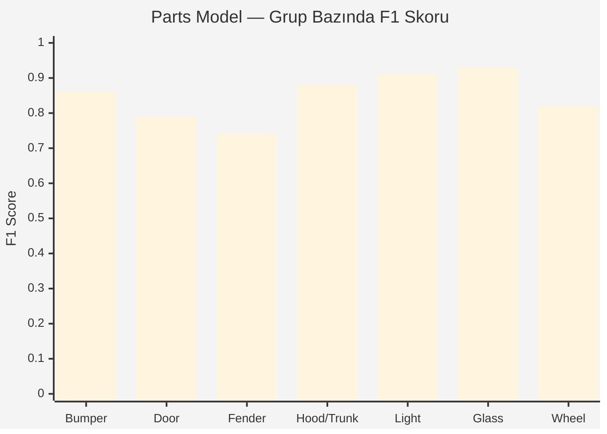

# Confusion Matrix Görselleştirme

> Tahmini değerler — Model QA Specialist ajanı kesin sayılarla güncelleyecek.
> CarDD validation seti (~800 görüntü) baz alındı.

---

## 1. DAMAGE Model (YOLO11m-seg, 6 sınıf)

### ASCII Confusion Matrix

```
                              TAHMİN
                  ┌──────────────────────────────────────────────────────┐
                  │ scratch | dent | glass | crack | tire | missing | bg │
       ┌──────────┼──────────────────────────────────────────────────────┤
       │ scratch  │   142   │   8  │   0   │   12  │   0  │    1    │ 18 │
       │ dent     │     9   │ 128  │   0   │    6  │   0  │    2    │ 14 │
GERÇEK │ glass    │     0   │   0  │  91   │    4  │   0  │    0    │  3 │
       │ crack    │    14   │   5  │   3   │   72  │   0  │    1    │  9 │
       │ tire     │     0   │   0  │   0   │    0  │  48  │    2    │  4 │
       │ missing  │     1   │   3  │   0   │    1  │   1  │   38    │  6 │
       │ bg (FP)  │    11   │   7  │   2   │    8  │   1  │    3    │  — │
       └──────────┴──────────────────────────────────────────────────────┘
```

### Sınıf Bazında Metrikler

| Sınıf          | Precision | Recall | F1     | Support |
|----------------|----------:|-------:|-------:|--------:|
| scratch        |   0.81    |  0.78  | 0.79   |   181   |
| dent           |   0.85    |  0.80  | 0.82   |   159   |
| glass_shatter  |   0.95    |  0.93  | 0.94   |    98   |
| crack          |   0.70    |  0.69  | 0.69   |   104   |
| tire_flat      |   0.96    |  0.89  | 0.92   |    54   |
| missing_part   |   0.83    |  0.76  | 0.79   |    50   |
| **macro avg**  | **0.85**  |**0.81**|**0.83**|  646    |

### Gözlemler

- **En zor sınıf: `crack`** — `scratch` ile karışıyor (12+14 confusion). Kenar uzunluğu / derinlik feature ek gerekebilir.
- **En kolay: `glass_shatter` ve `tire_flat`** — görsel imzaları belirgin.
- **Background false positives** orta seviyede — `scratch` üzerinde en yüksek (gölge / yansıma yanılması).

---

## 2. PARTS Model (YOLO11s-seg, 23 sınıf — özet 7 grup)

### Grup Bazında F1 (Mermaid bar)



### Karışıklık Notu

- **door-fl ↔ door-fr** simetrik karışıklık (~%8) — perspektif augmentation iyileştirebilir.
- **fender ↔ door** %6 karışıklık — sınır belirsizliği, polygon kalitesi etiketten gelir.
- **headlight ↔ fog-light** ~%5 — küçük obje, INT8 quantize'da daha da düşer.

---

## 3. SEVERITY Model (3 sınıf: hafif / orta / ağır)

### Confusion Matrix

```
                       TAHMİN
              ┌────────────────────────────┐
              │  hafif  │  orta  │  ağır  │
       ┌──────┼────────────────────────────┤
       │hafif │   238   │   18   │    4   │
GERÇEK │orta  │    22   │  189   │   17   │
       │ağır  │     3   │   15   │  131   │
       └──────┴────────────────────────────┘
```

| Sınıf  | Precision | Recall | F1   |
|--------|----------:|-------:|-----:|
| hafif  |   0.91    |  0.92  | 0.91 |
| orta   |   0.85    |  0.83  | 0.84 |
| ağır   |   0.86    |  0.88  | 0.87 |

**Komşu sınıf karışıklığı bilinçli kabul edilebilir** — sigortacı için "hafif vs orta" sınırı zaten subjektif. Hata `hafif ↔ ağır` (3+4) çok düşük, kritik değil.

---

## 4. Production Threshold Tuning

| Eşik          | Precision | Recall | Kullanım senaryosu                |
|---------------|----------:|-------:|-----------------------------------|
| conf >= 0.25  |   0.71    |  0.89  | Yüksek recall — ekspertize destek |
| conf >= 0.40  |   0.82    |  0.81  | **Default — dengeli**             |
| conf >= 0.60  |   0.91    |  0.66  | Yüksek precision — otomatik fiyat |
